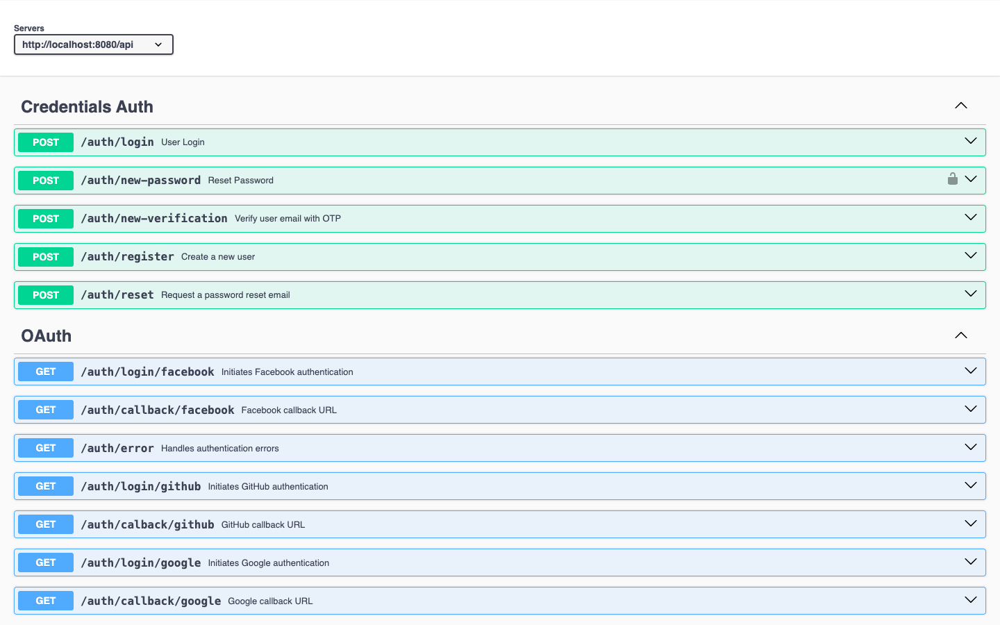

# Auther - Pre-built authentication templates (Nodejs)


This a backend with pre-built authentication made using Nodejs and Typescript. Follow the instructions below to clone the repository and run the application.


## Prerequisites

  

Ensure you have the following installed on your system:

- [Git](https://git-scm.com/)
- [Node.js](https://nodejs.org/en) (version 18.17.0 or higher)

  

## Getting Started

  

### Clone the Repository

  

First, clone the repository using Git:

 
```sh
git  clone  https://github.com/Soumyadas15/auther
```

Move to project directory
```sh
cd auther
```

### Running the Nodejs backend

Move to 'backend' directory
```sh
cd backends/nodejs
```

And run to install the Nodejs dependencies
```sh
npm install
```

After that, create a .env file with the fields given in .env.example.

After that, run
```sh
npm start
```

Wait for a while to see these logs in the console
```sh
Server running on port 8080
```

After running, you visit http://localhost:8080/api-docs to see a detailed API documentation

### Running the frontend locally

After running the backend, navigate to the project directory using
```sh
cd ..
cd ..
```
Then navigate to the frontend directory
```sh
cd frontend
```

In the root directory, create a file called .env and paste these and save
```sh
API_URL="http://localhost:8080/api"
NEXT_PUBLIC_API_URL="http://localhost:8080/api"
```
After that, run the command to install dependencies
```sh
npm install
```
And finally run the app using
```sh
npm run dev
```

Visit http://localhost:3000 on your browser to see it running.


### APIs:

To get extensive details of the apis, visit http://localhost:8080/api-docs after running the backend server

### Authentication

When a user logs in via the `/api/auth/login` endpoint, a JWT token is returned. This token is then stored in cookies on the frontend. For every subsequent request, the JWT token is retrieved from the cookies and sent along with the request.

